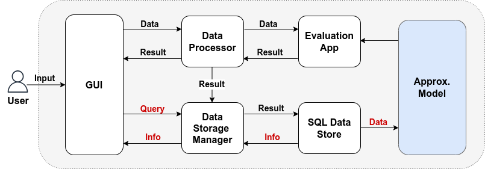

# Investment Recommendation Software

The software is a webapp created for a client which performs evaluation and advises the client whether to invest in a business or not.
It also informs the client of what amount of money he can invest in the business.
It does this by evaluating information about the business and also the business owner.

## Installation

- Download the application code:
    ```
    git clone https://github.com/tissadeking/investment_reco.git
    ```
- Enter the project directory:
    ```
    cd investment_reco

- To run the software:
  - Have Java and its dependencies intalled on your system.
  - Set up Servlet and Tomcat server.
  - Create a Servlet project through any IDE of your choice, eg Eclipse, name the project investment_check.
  - Copy the src folder from the investment_reco directory you cloned and replace the src folder in the investment_check project you created with it.
  - Open Eclipse Java EE (Enterprise edition ) environment. Click on Servers tab at bottom. Click on No servers are available. Click this to create server.
  - A dialog box will appear. Select Tomcat 9.0 server folder. Click Next.
  - Browse to Apache Tomcat 9.0 folder select it. Click Finish.
  - You should see Tomcat v9.0 Server at localhost [Stopped, Republish] under Servers tab.
  - Right-click on Server and click Start. If there is any application running on default port 8080 then change it to any other port.

## Accessing the webapp
- Go to http://localhost:8080/investment_check and view the app.

## Software Architecture


## Workflows Description
- The client enters the details about the business and the business owner through the GUI. This data contains: the amount to be invested, the amount of profits made by the business owner monthly, the worth of landed property owned by the business owner, etc. The data is received and processed by the Data Processor and sent to the Evaluation App. The Evaluation App uses the Approximation Model which is a log-transformed linear regression model trained on previous investment data of our client, to evaluate whether the desired amount should be invested in the business. If the answer is no, the Evaluation App also performs a simple optimisation to determine the suitable amount of money to be invested in the business. It forwards this result to the Data Processor which in turn translates it to natural language response to the client at the GUI.
- The Data Processor also sends the result to the Data Storage Manager which stores the data inside the SQL Data Store for future use.
- An additional functionality that could be implemented which is not part of the minimal viable product (MVP) of the software is the ability of the Approximation Model to receive data from the SQL Data Store and improve itself for better evaluation later. Also, the client can query the data stored in the SQL Data Store about previous investments he made or rejected, and the information about the investments would be outputted to him through the GUI.

